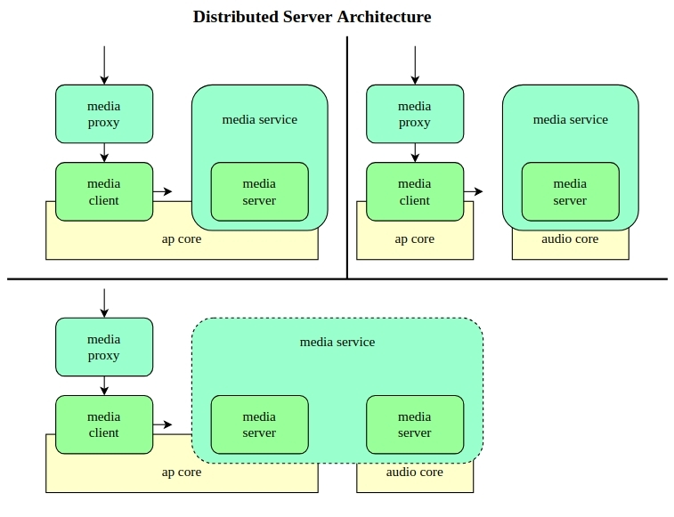

# **Media Framework**

[English|[简体中文](README_zh-cn.md)]

## **Overview**

Media Framework is a library for audio and video processing, offering a rich API for applications. Media Framework employs a **client-server architecture**. The client interface packages commands and sends them to the server via RPC. The server's loop performs the actual work. Media Framework supports playback and recording of multiple audio and video formats. It has a distributed architecture that enables it to run on multiple CPUs.

## **Functional Characteristics**

The main functional modules of Media Framework include **Media Player**, **Media Recorder**, **Media Focus**, **Media Policy** and **Media Session**, among which Media Player and Media Recorder are encapsulated by **Media Graph** module.

### **Media Player**

- **Playback service**: the ability to create a playback instance and then control the playback.

- **Format Support**: Supports a wide range of audio and video formats to ensure broad compatibility.

- **Playback control**: Provide rich playback control functions, such as play, pause, stop, fast forward, etc., to meet the user's various needs for audio and video playback.

### **Media Recorder**

- **Recording Service**: the ability to create a recording instance and then control the recording.

- **Format Support**: Supports a wide range of audio and video formats to ensure broad compatibility.

- **Recording Control**: Provide rich recording control functions, such as start recording, pause recording, stop recording, etc., to meet the user's various needs for audio and video recording.

### **Media Focus**

Efficiently handle multiple applications competing for media focus by designing focus management mechanisms. Ensure that only one application gets the media focus and plays media at a given time. Users can subscribe to the focus, participate in the focus's focus grabbing logic, and get behavioral suggestions provided by the focus for a smooth user experience.

### **Media Policy**

Media Policy constructs routing policy, audio policy and other states through **PFW**, which can be extended by plug-ins to support processing FFmpeg commands and setting device parameters. In addition, by writing a Policy configuration file and setting parameters to the Policy, you can change some global states of the Graph, such as link switching of input/output devices and volume control, etc., in accordance with the established policies in the configuration file, providing users with a highly customizable media processing environment.

### **Media Session**

Adopts a controller and controlled architecture to realize fine-grained control and status notification of media playback. Provides functions such as registering controllers and controlled, sending control commands, handling event notifications and updating media metadata, which facilitates unified management and control of multiple media clients.

### **Media RPC**

  Dual socket communication model: we use two separate sockets for communication, regardless of whether they are cross-core or not.
  - **Trans socket** is responsible for transmitting control commands from client to server, and at the same time transmitting rpc execution results.
  - **Notify socket** is responsible for transmitting message notification from server to client, which will be delivered to user via callback.

  

  **Generic**: For Player, Recorder, Session, Policy, and Focus users, the RPC mechanism is generic, allowing applications to communicate between different CPUs.

  Mode support: Media Framework supports both synchronous and asynchronous modes of RPC.
  - **Synchronous mode**: the client sends a request and waits for a response from the server, suitable for scenarios that require immediate feedback.
  - **Asynchronous mode**: the client sends a request and returns immediately, and the server notifies the client through a callback after processing the request, providing an efficient communication mechanism that ensures reliable and real-time data transmission.

## **Media Framework Architecture**

[Client Model](./client/README.md)

[Server Model](./server/README.md)

## **Test Media Framework**

 The Mediatool test program is used to test the Media Framework API, which can simulate real-world usage scenarios.

[Test the Media Framework API with the Mediatool tool](./mediatool.md)
