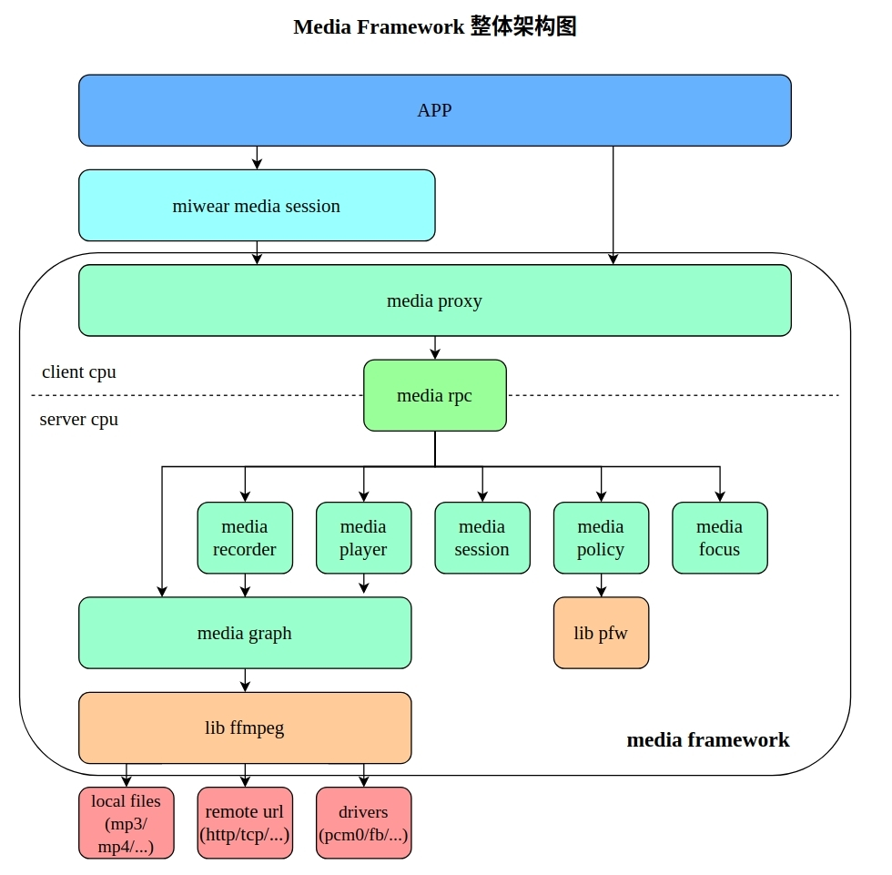
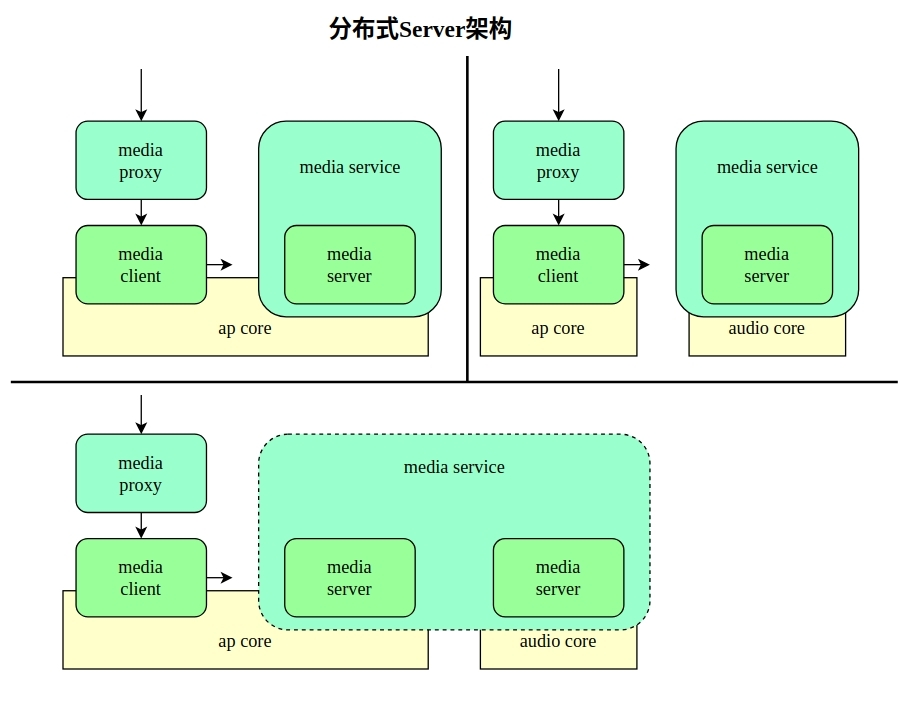

# **Media Framework**

[[English](./README.md) | 简体中文]

## **概述**

Media Framework 是一个用于处理音视频的库，提供了丰富的 API 供应用程序调用。Media Framework 采用 **CS 架构**，Client 接口会把命令打包通过 RPC 发送到 Server 上，由 Server 的 loop 做实际的工作。Media Framework 支持多种音频和视频格式的播放和录制，并且具有分布式架构，可以在多个 CPU 上运行。

## **功能特性**

Media Framework 主要功能模块包括 **Media Player**、**Media Recorder**、**Media Focus**、**Media Policy** 和 **Media Session**，其中 **Media Player** 和 **Media Recorder**由 **Media Graph** 模块封装。

### **Media Player**

- **播放服务**：能够创建一个播放实例，然后控制播放。

- **格式支持**：支持多种音频和视频格式，确保广泛的兼容性。

- **播放控制**：提供丰富的播放控制功能，如播放、暂停、停止、快进等，满足用户对音视频播放的各种需求。

### **Media Recorder**

- **录制服务**：能够创建一个录制实例，然后控制录制。

- **格式支持**：支持多种音频和视频格式，确保广泛的兼容性。

- **录制控制**：提供丰富的录制控制功能，如开启录制、暂停录制、停止录制等，满足用户对音视频录制的各种需求。

### **Media Focus**

通过设计焦点管理机制，有效地处理多个应用对媒体焦点的竞争。确保在特定时间只有一个应用获得媒体焦点并播放媒体。用户可以订阅焦点，参与到焦点的**焦点抢占**逻辑中，获得焦点提供的行为建议，从而获取流畅的用户体验。

### **Media Policy**

Media Policy 通过 **PFW** 来构造路由策略、音频策略等各种状态，可以通过插件进行扩展，支持处理 FFmpeg 命令和设置设备参数等功能。此外，通过编写 Policy 配置文件，往 Policy 设置参数，可以按照配置文件中既定的策略来改变 Graph 的一些全局状态，比如输入输出设备的链路切换和音量控制等，为用户提供高度可定制的媒体处理环境。

### **Media Session**

采用控制者和被控制者的架构，实现对媒体播放的精细控制和状态通知。提供注册控制者和被控制者、发送控制命令、处理事件通知和更新媒体元数据等功能，便于对多个媒体客户端进行统一管理和控制。

### **Media RPC**

  双 socket 通信模型：不论是否跨核，我们都使用两个独立的 socket 来实现通信。
  - **Trans socket** 负责传输 Client 到 Server 的控制命令，同时回传 RPC 执行结果。
  - **Notify socket** 负责传输 Server 到 Client 的消息通知，通过回调传递给用户。

  

  **通用性**：对于 Player、Recorder、Session、Policy、Focus 用户，RPC 机制都是通用的，允许应用程序在不同 CPU 之间进行通信。

  **模式支持** ：Media Framework 支持同步与异步模式的 RPC 。
  - **同步模式**：客户端发送请求并等待服务器响应，适用于需要立即反馈的场景。
  - **异步模式**：客户端发送请求后立即返回，服务器在处理完请求后通过回调通知客户端，提供高效的通信机制，确保数据传输的可靠性和实时性。

## **Media Framework 架构**

[Client模块](./client/README_zh-cn.md)

[Server模块](./server/README_zh-cn.md)

## **测试 Media Framework**

 采用 Mediatool 测试程序，用于测试 Media Framework API，可模拟实际使用场景。

[使用Mediatool工具测试Media Framework API](./mediatool_zh-cn.md)
