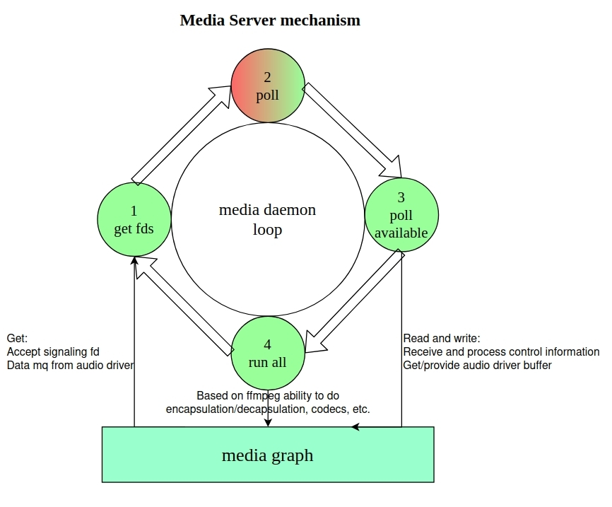

# **Media Server**

[English|[简体中文](./README_zh-cn.md)]

## **Overview**

 The Media Server provides a comprehensive set of functions. Based on an event loop model, it handles various media events and client interactions, offering functions such as audio and video playback, audio and video recording, focus management, policy execution, and session control.

## **Project Directory**
```tree
.
├── focus_stack.c
├── focus_stack.h
├── media_daemon.c
├── media_focus.c
├── media_graph.c
├── media_policy.c
├── media_server.c
├── media_server.h
├── media_session.c
├── media_stub.c
└── README.md
```

## **Module Introduction**

### **Media Daemon**

 Media Daemon is the core of Media Server, responsible for creating and managing Media modules, such as Media Focus, Media Graph, Media Session, Media Policy, etc. The core principle of the Media Daemon is to use the **poll** function to **listen to the RPC socket fd**and the **message queue fd registered by the audio/video device driver**, to **process the RPC commands** and **trigger the work of FFmpeg**.

  

 The main work of Media Daemon is carried out in a loop, the general steps are as follows:
- Initialize the creation of each module instance, such as Media Focus, etc.
- Get event fd through the **media_get_pollfds** interface to obtain the event fd of each module.
- Use poll to block and wait for the event. When an event is detected, poll returns.
- Handle the event by calling **media_poll_available** when poll returns.
- Execute run once (mainly ffmpeg) to ensure effective resource management and scheduling.

### **Media Focus**

 The Media Focus module is an important part of the Media Server, designed to provide playback policies for scenarios where multiple audio streams are mixed together. It helps to ensure that only one audio stream is played as the primary audio content at a time, while other audio streams are either downgraded to secondary streams or paused. The media focus mechanism is a cooperative preemption type, allowing applications to still play music without using media focus, but they cannot access the audio focus management system, which may impact user experience.
-  The configuration file for the default sound event type interaction is located in **/etc/media**.
-  The input of sound event types is based on the different **MEDIA_SCENARIO_XXX** macros in the media wrapper. Currently, it contains 11 types of sound events.
-  Supports application-initiated **focus reques**t, **dropping focus request**, **focus change notification**, etc.

### **Media Garph**

 The principle of the Media Graph is to link the inputs and outputs of audio and video related filters together to form a playback and recording chain. The main strategies are as follows:
 - Load the graph configuration file to create and configure the media graph and corresponding filters.
 - Provide a series of functions to handle the commands and events of filters, including opening, closing, playing, pausing, stopping, setting event callbacks, handling command queues, and other operations.
 - Encapsulate the operation interfaces of Media Player and Media Recorder and call the FFmpeg library to realize playback and recording functions.

### **Media Policy**

 The Media Policy module on the Server side provides a series of functions to handle operations such as setting, obtaining and notification of media policies, and provides a unified interface to APP in different projects to transform the user's **routing and volume control information into control commands** for the device driver; in different projects, Policy will use different configuration files to handle the Policy interfaces for mapping control commands. Media Policy's policies are implemented through configuration files:
 - Modify ffmpeg filter graph configuration file to control the filter of graph through policy, for volume and link control.
 - Write pfw configuration file to realize plugin extension and so on.

### **Media Server**

The Media server module listens to different types of sockets, receives connection requests from clients, and uses callback functions to process the received data. The following features are supported:
- Create server instances, destroys server instances.
- The **media_server_get_pollfds** interface gets a list of file descriptors for polling.
- The **media_server_poll_available** handles file descriptor events.
- The **media_server_notify** sends notifications to specific connections and manages connection data, etc.

### **Media Session**

 The media session module on the server side plays a crucial role in the media framework. Through the designed controller and controlled architecture, it realizes efficient control of media playback and accurate status notifications.
 - **Controllers**:  Only wants to control other streams, receive status change notifications, or query information, and is not responsible for the creation and destruction of streams.
 - **Controlled entity**: Holds the playback status of certain streams and needs to be responsible for the creation, destruction, and playback functions of these streams. At the same time, it needs to update its own status information in a timely manner.
 - For example, when a speaker plays music from a mobile phone:
   - Controller: The UI interface is the controller.
   - Controlled entity: The Bluetooth module that establishes an audio channel with the mobile phone is the controlled entity.
  
### **FFmpeg**
 The Media Graph module achieves functions such as audio and video encoding and decoding, encapsulation and decapsulation, as well as audio and video stream processing by calling the FFmpeg library. With the help of FFmpeg, the system can meet diverse multimedia requirements, including but not limited to video playback, video recording, taking photos, and audio and video editing.

Inside FFmpeg, audio and video data are processed by enabling modules such as the demultiplexer (demuxer), decoder, multiplexer (muxer), encoder, and filter. FFmpeg combines modules like the demuxer, decoder, and filter into a complete processing pipeline to realize complete functions such as video playback and video recording.

Specifically, the filters required for each function are connected in advance through a configuration file (conf file). Then, the FFmpeg API is used to parse and initialize this configuration file, thereby constructing the processing pipeline. By inputting data into this pipeline, data transmission can be achieved.

The FFmpeg function is enabled by configuring the parameter CONFIG_LIB_FFMPEG=y, and the above - mentioned modules are configured through CONFIG_LIB_FFMPEG_CONFIGURATION.
- **demuxer**：The demultiplexing module is used to extract audio and video streams from various audio and video containers and send them to the decoder for decoding. For example, it supports mp3 and mp4 formats, and can be enabled by configuring parameters such as CONFIG_LIB_FFMPEG_CONFIGURATION="--enable - demuxer='mp3,mp4'".
- **decoder**：It is used to decode the audio and video data processed by the demuxer. For example, it supports h264 and aac formats, and can be enabled by configuring parameters such as CONFIG_LIB_FFMPEG_CONFIGURATION="--enable - decoder='h264,aac'".
- **muxer**：The multiplexing module is used to encapsulate various audio and video streams into a complete container according to the rules of a specific multimedia container format. Similar to the demuxer, it can be enabled by configuring parameters such as CONFIG_LIB_FFMPEG_CONFIGURATION="--enable - muxer='mp3,mp4'".
- **encoder**：It is used to encode the audio and video data processed by the muxer. Similar to the decoder, it can be enabled by configuring parameters such as CONFIG_LIB_FFMPEG_CONFIGURATION="--enable - encoder='h264,aac'".
- **filter**：It is used to process audio and video data, such as cropping, scaling, rotating audio and video, mixing audio and video, encoding and decoding audio and video, and encapsulating and decapsulating audio and video. For example, the following path is configured within the graph, and the specific path is: /vendor/openvela/boards/vela/src/etc/media/graph.conf:
  ```
  adevsrc@pcm0c=format=nuttx:devname=/dev/audio/pcm0c[a],
  devsrc@InVsrc=d=/dev/video:s=640x480:r=30[v],
  [v]streamselect@SelVideo=inputs=1:map=0 -1[vout0][vout1],
  [vout0]devsink@fb=format=fbdev:devname=/dev/fb0,
  [a][vout1]moviesink_async@cap
  ```
  - The adevsrc filter obtains audio data from the driver device file /dev/audio/pcm0c, and the devsrc filter obtains video data from the driver device file. Then, the audio/video data is sent to the moviesink_async filter through the streamselect filter to achieve the video recording function and generate a video file.
  - The devsrc filter obtains video data from the driver device file, sends the data to the devsink through the streamselect filter, and finally sends the video data to the framebuffer through the driver device node /dev/fb0 for display to achieve the image preview function.
