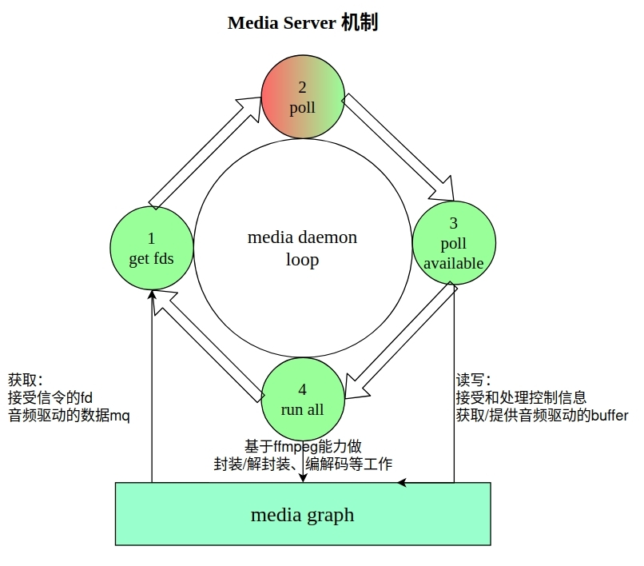

# **Media Server**

[[English](./README.md)|简体中文]

## **概述**

 Media Server 端提供了一套全面的功能，基于事件循环模型，处理各种媒体事件以及客户端交互，为用户提供音频和视频播放、录制音视频、焦点管理、策略执行以及会话控制等功能。

## **项目目录**

```tree
.
├── focus_stack.c
├── focus_stack.h
├── media_daemon.c
├── media_focus.c
├── media_graph.c
├── media_policy.c
├── media_server.c
├── media_server.h
├── media_session.c
├── media_stub.c
└── README.md
```
## **模块介绍**

### **Media Daemon**

 Media Daemon 是 Media Server的核心，负责创建和管理Media的各个模块，如 Media Focus、Media Graph、Media Session、Media Policy等。Medid Daemon 的核心原理是使用**poll** 函数, 监听RPC socket fd,和音视频设备驱动注册的 message queue fd,处理 RPC 命令并触发 FFmpeg 工作。

 

 Media Daemon 的主要工作在一个循环中进行，大体步骤如下：
- 初始化创各个模块实例，Media Focus 等。
- 获取事件 fd,通过 **media_get_pollfds** 接口获取各个模块的事件 fd。
- 使用poll阻塞等待事件，当监听到有事件发生，则 poll返回。
- 处理事件，当 poll 返回，调用 media_poll_available 处理事件。
- 执行 run once（主要是ffmpeg），确保资源的有效管理和调度。

### **Media Focus**

 Media Focus 模块是 Media Server 的一个重要组成部分，目的是给多个音频流混合一起放送场场景提供播放策略，协助实现同一时间内只有一个音频作为主音频内容被放送，其他音频变为次要音频或暂停输出的使用场景。Media Focus 的机制为合作抢占型，不使用 Media Focus 应用依旧可以播放音乐，但无法接入到音频焦点管理体系，此时出现的非策略性声音混合可能会对用户使用体验造成影响。
- 默认声音事件类型交互的配置文件位于 **/etc/media**。
- 声音事件类型的输入以 media wrapper 中的不同 **MEDIA_SCENARIO_XXX** 宏为准。目前包含11种类型的声音事件。
- 支持应用发起**焦点请求**、**放弃焦点请求**、**焦点改变通知**等功能。

### **Media Garph**

 Media Graph 的原理是将音视频相关的 **filter** 的 **inputs** , **outputs** 链接在一起，构成播放和录制的链路。主要策略如下：
 - 加载 graph 配置文件创建和配置 Media Graph 及相应的 filter。
 - 提供一系列函数处理 filter 的命令和事件，包括**打开**、**关闭**、**播放**、**暂停**、**停止**、**设置事件回调**、**处理命令队列**等操作。
 - 封装 Media Player 和 Media Recoder 的操作接口，调用 ffempeg 库，实现播放和录制功能。

### **Media Policy**

 Server 端的 Media Policy 模块，提供了一系列函数来处理媒体策略的设置、获取和通知等操作，在不同的项目中向APP提供统一的接口，把用户的**路由和音量的控制信息转化成对设备驱动的控制命令**；在不同的项目中，Policy 会使用不同的配置文件来处理 Policy 接口的控制命令的映射关系。 Media Policy 的策略通过配置文件实现：
 - 修改 ffmpeg filter graph 配置文件，通过 Policy控制 graph 的 filter，进行音量和链路控制。
 - 编写 pfw 配置文件实现插件扩展等。

### **Media Server**

 Media Server 模块通过监听不同类型的 socket，接收来自 Client 的连接请求，并使用回调函数处理接收的数据。支持下述功能：
- 创建服务器实例、销毁服务器实例。
- media_server_get_pollfds接口获取用于轮询的文件描述符列表。
- media_server_poll_available处理文件描述符事件。
- media_server_notify向特定连接发送通知和管理连接数据等。

### **Media Session**

 Server端的 media session 模块在媒体框架中扮演着关键的角色，通过设计的控制者和受控者的架构，实现了对媒体播放的高效控制和准确的状态通知。
 - **控制者**：只想控制其他流、接受状态变化通知、或者查询信息，不会对流的创建和销毁负责。
 - **受控者**:掌握着某些流的播放状态，需要负责对这些流的创建，销毁，以及播放功能，同时需要及时地更新自己的状态信息。
 - 举例，如音响播放来自手机的音乐：
   - 控制者：UI界面是控制者；
   - 受控者：与手机建立音频通道的蓝牙模块是受控者。
